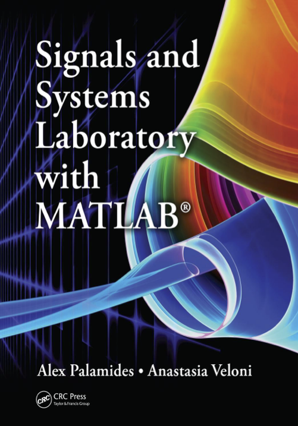
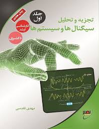
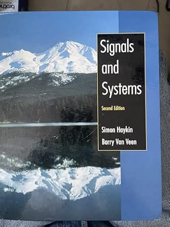

# **Signals & Systems**

> **Signals & Systems, Supervisor: [Dr. Siavash Rajabi](https://github.com/siavashrajabi)**  
> ***CE/EE Departments, Hamedan University of Technology***

> **Course Maintainer, Teaching Assistant & Python Lab Instructor:**  
> **[Arman Esmaeili](https://github.com/ArmanEsmaeili)**

## Synopsis

Welcome to the **Signals & Systems** repository.

This repository integrates theoretical concepts of signals and systems with practical Python simulations to strengthen understanding. By combining mathematical analysis with computational experiments, students gain deeper insight into fundamental topics that form the foundation of Digital Signal Processing (DSP).

## References

1. **Signals and Systems**, 2nd Edition  
   *Alan V. Oppenheim, Alan S. Willsky, S. Hamid Nawab*  
   A foundational undergraduate textbook covering continuous-time and discrete-time signal analysis, LTI systems, convolution, Fourier analysis, and Laplace transforms.  
   📘 [Amazon Link](https://www.amazon.com/Signals-Systems-2nd-Alan-Oppenheim/dp/B002664E12)  
   🖨️ [Download Link](https://www.cedric-richard.fr/assets/files/Signals_and_Systems_2nd_Edition_by_Oppen.pdf)

2. **Signals and Systems Laboratory with MATLAB**, 1st Edition  
   *Alex Palamides, Anastasia Veloni*  
   A complementary laboratory manual integrating MATLAB exercises and examples alongside key signals and systems concepts, ideal for hands-on computational practice.  
   📘 [Amazon Link](https://www.amazon.com/Signals-Systems-Laboratory-MATLAB-Palamides/dp/143983055X)  
   🖨️ [Download Link](https://s34.picofile.com/file/8488261084/Signals_and_systems_laboratory.pdf.html)

3. **Signals and Systems**, 2nd Edition  
   *Simon Haykin, Barry Van Veen*  
   A comprehensive treatment of signal representation and linear systems with strong emphasis on practical engineering applications and problem-solving.  
   📘 [Amazon Link](https://www.amazon.com/Signals-Systems-2nd-Simon-Haykin/dp/047138309X)  
   🖨️ [Download link](https://pdfcoffee.com/signals-and-systems-2ndsimon-haykin-4-pdf-free.html)

---

4. **تجزیه و تحلیل سیگنال‌ها و سیستم‌ها**  
   *مهدی تقدسی — انتشارات نصیر*  
   مرجع فارسی که پایه‌های نظری سیگنال‌ها و سیستم‌ها را پوشش می‌دهد و در دانشگاه‌های ایران کاربرد گسترده‌ای دارد.  

   📘 [انتشارات پوران پژوهش](https://pouran.net/product/%D8%AA%D8%AC%D8%B2%DB%8C%D9%87-%D9%88-%D8%AA%D8%AD%D9%84%DB%8C%D9%84-%D8%B3%DB%8C%DA%AF%D9%86%D8%A7%D9%84-%D9%87%D8%A7-%D9%88-%D8%B3%DB%8C%D8%B3%D8%AA%D9%85-%D9%87%D8%A7-%D8%AC%D9%84%D8%AF-%D8%A7%D9%88%D9%84-%D9%85%D9%87%D8%AF%DB%8C-%D8%AA%D9%82%D8%AF%D8%B3%DB%8C-%D8%A7%D9%86%D8%AA%D8%B4%D8%A7%D8%B1%D8%A7%D8%AA-%D9%86%D8%B5%DB%8C%D8%B1/)

---

  
  
  
  

